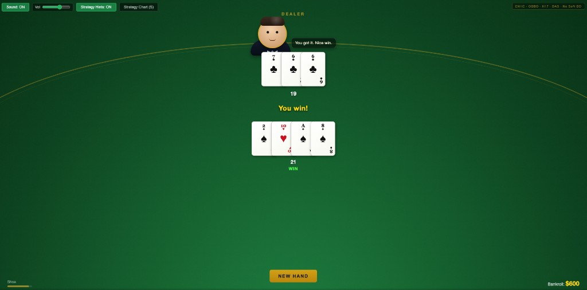

# Blackjack Trainer

A single-page Blackjack trainer focused on realistic decision practice with a custom casino ruleset.

This project is designed to help you learn and drill basic strategy while playing full rounds in an interactive table UI with chips, sound effects, and dealer feedback.

## Why I Built This

Most blackjack trainers online optimise for generic strategy practice, but many use American hole-card rules rather than the European No Hole Card format more relevant to New Zealand.

I wanted a trainer that was both more locally relevant while still having a nice appearance, so I built one that combines an NZ-style ruleset with a table presentation.

## What This Game Includes

- Interactive Blackjack table UI (`blackjack.html`)
- Betting chips and bankroll tracking
- Multi-hand support with split and double logic
- In-game strategy chart overlay
- Optional strategy feedback while playing
- Card/chip/action sound effects
- Dealer avatar and table commentary

## Rules Implemented

This trainer follows a specific rules variant (not default Blackjack):

- **ENHC** (European No Hole Card): dealer starts with one upcard and completes hand after player actions
- **OBBO** (Original Bets Only): versus dealer blackjack, only original bet loses; extra split/double wagers push
- **H17**: dealer hits soft 17
- **DAS**: double after split is allowed
- **No soft double**: doubling is only allowed on hard totals
- **Split aces once**: one card per split ace hand, no further actions on those hands

## Run Locally

From the project root:

```bash
python3 serve.py
```

Then open:

`http://127.0.0.1:8090/blackjack.html`

On macOS you can double-click **`Play Blackjack.command`**, which starts that server (if it is not already running) and opens the same URL. Do not open `index.html` directly from the Finder, or `fetch` will not load the CSV and sounds.

While the game tab is open, the page pings the server every few seconds. About **5 seconds** after you close the tab (or stop pings), the server exits so it is not left running in the background.

## Screenshots



## Project Files

- `index.html` - main game UI and logic
- `basic_strategy_enhc_obbo_h17_das.csv` - basic strategy source (loaded for the chart and strategy hints)
- `assets/sounds/` - CC0 casino/card foley (see `assets/sounds/ATTRIBUTION.txt`)
- `serve.py` - simple local static server (port 8090)
- `server.rb` - alternate simple server script
- `Play Blackjack.command` - launcher script for macOS

## Notes

This project was built with the assistance of AI tools including ChatGPT, Claude, and Cursor.
The software is for educational and training purposes only.
No guarantee of accuracy is provided. Use at your own risk.
